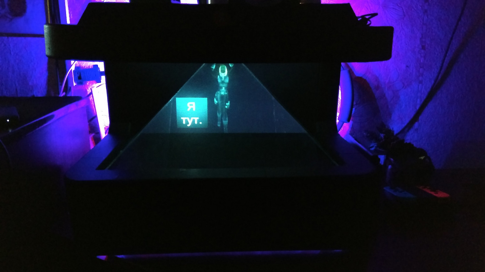
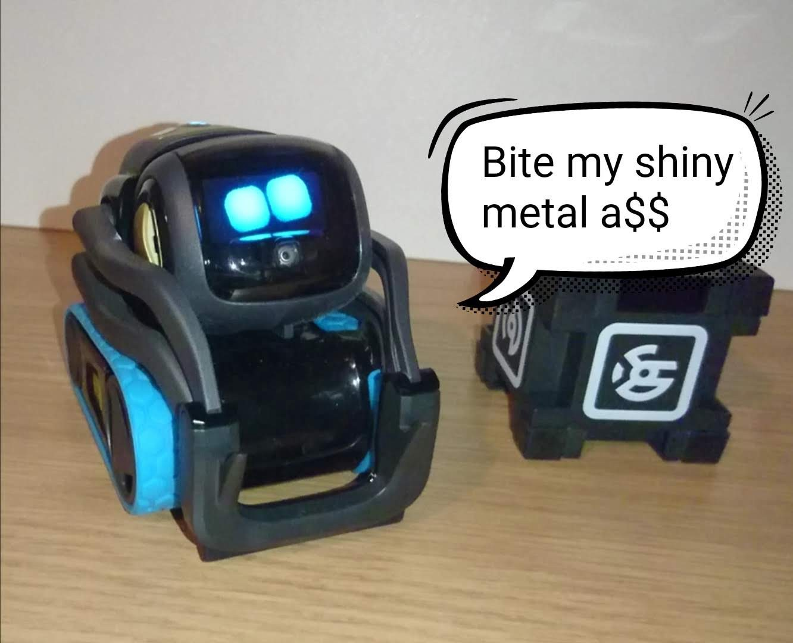
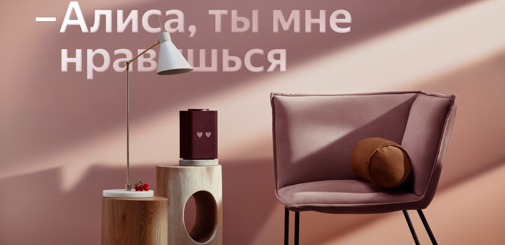
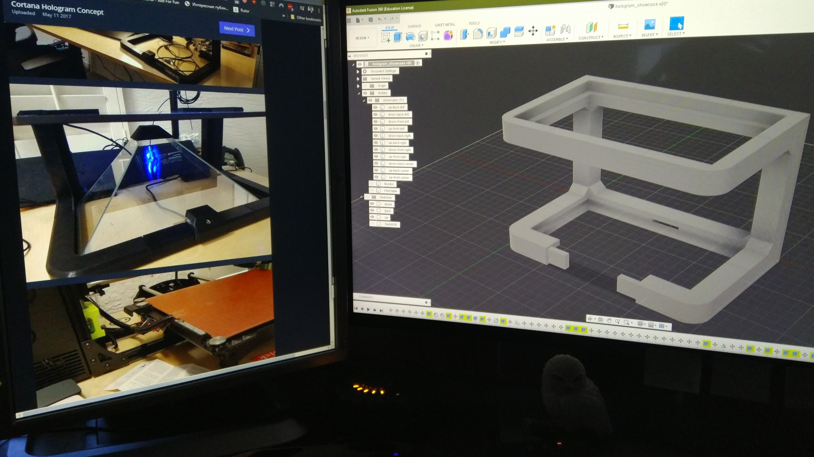
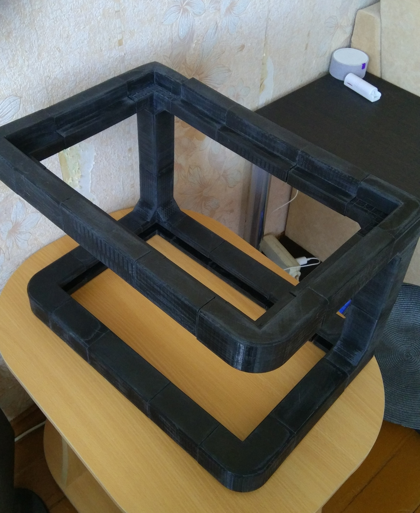
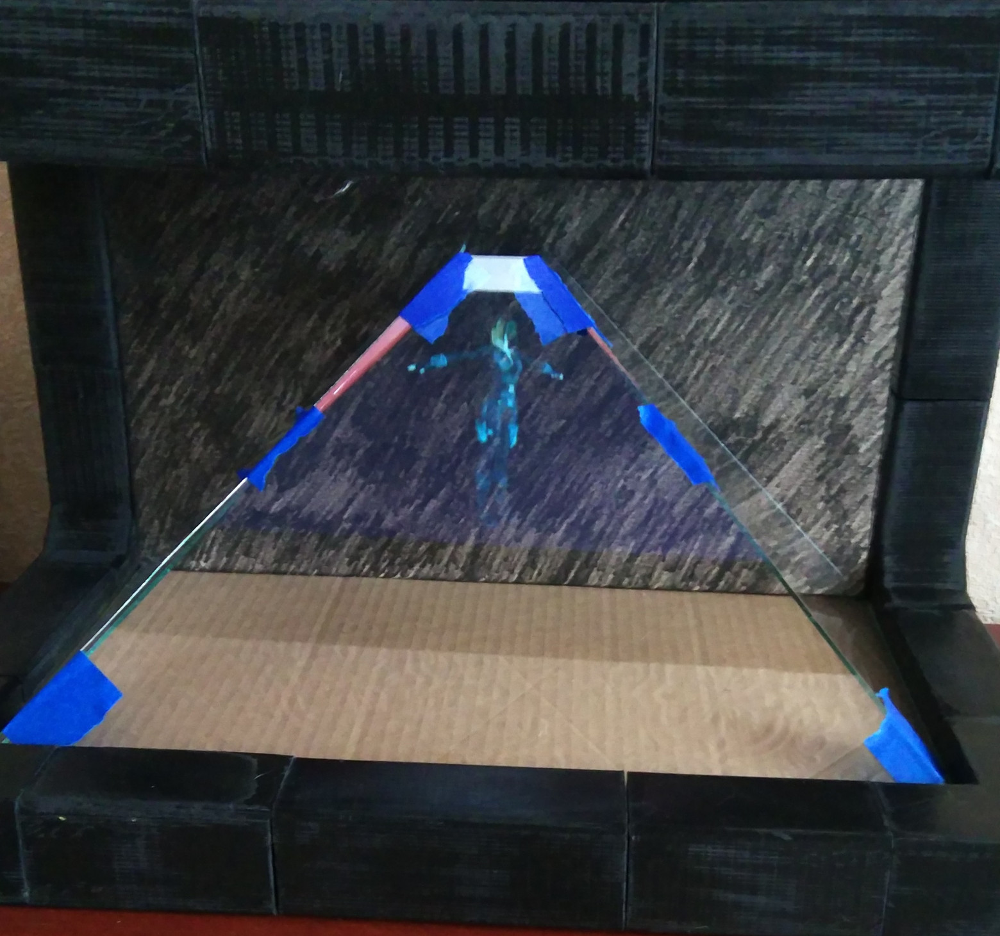
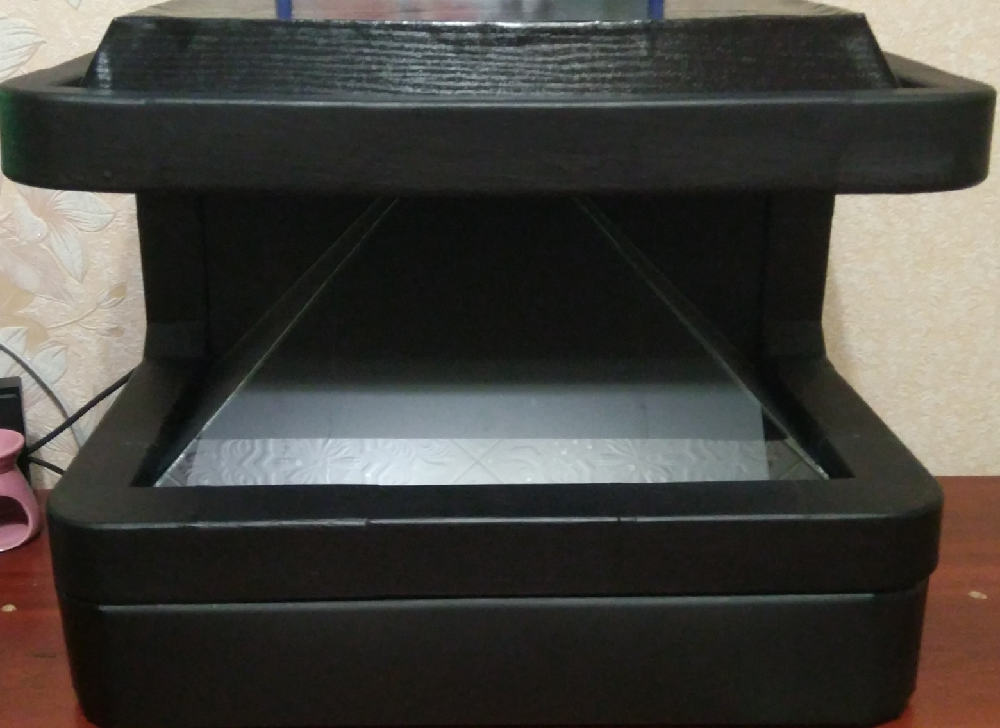
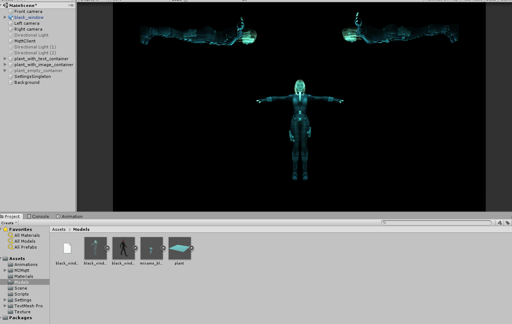
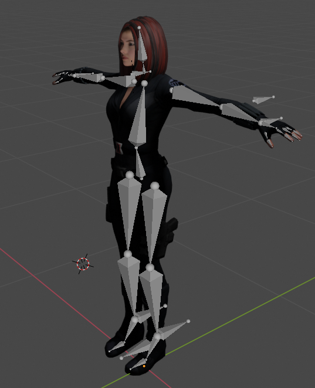
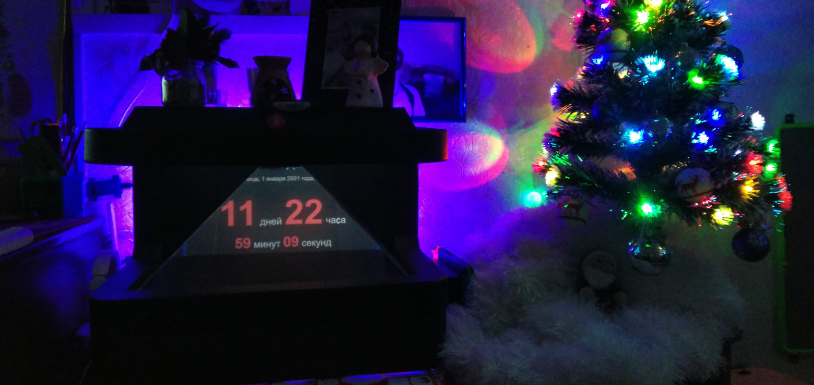

Всем привет. Говорят, лень - это двигатель прогресса. Но никто не говорил, что этот самый двигатель, будет быстрым.
Моя история о том, как я делал визуализацию голосового помощника Алисы с эффектом голограммы из подручных материалов.

<!--truncate-->

# Вступление

Мне всегда нравилась идея визуализации ассистентов, т.к. через визуализацию передаются "эмоции" человеку,
что позволяет воспринимать устройство не как коробку с динамиком (или как бы сказал один журналист "девчонку в коробчонке"),
но и как питомца. Почему-то крупные производители голосовых помощников не делают подобных устройств.

Например, у меня есть робот – голосовой помощник "Vector" от Anki (сейчас им владеет Digital Dream Labs).
Он отлично передает эмоции (радость, огорчение, злость и т.д.), когда с ним взаимодействуешь. Но его проблема в том,
что программная часть голосового помощника Vector очень слабая по сравнению с такими гигантами как Alexa, Google Assistant, Siri, Алиса.

Недавно Яндекс выпустил умную колонку Яндекс.Станция Макс с LED-дисплеем.
Через дисплей, голосовой помощник "Алиса" дополняет свои ответы анимацией и выражает "эмоции".
И это уже хороший шаг в сторону визуализации голосового помощника, но все равно этого недостаточно для меня.

Бороздя просторы интернета во время всеобщего карантина, я увидел пост о том,
как Джарем Арчер сделал рабочий концепт голограммы голосового помощника Cortana от Microsoft.
Я вдохновился этой идеей и захотел это повторить, только вместо Кортаны, взять Алису от Яндекса.

Посмотрев, как Джарем сделал визуализацию Кортаны и прикинув по стоимости необходимые компоненты, понял,
что это выйдет дороговато для моего первого, домашнего проекта.
Т.к. я живу в населенном пункте с численностью населения не больше 2000 человек и с одним местным продуктовым магазином,
то все компоненты нужно было заказывать через интернет, а доставка до меня очень долгая. Поэтому решил использовал всё то, что было под рукой:

* Старый монитор c TFT матрицей (BenQ GW2750HM)
* Старый ноутбук (core 2 duo p7350, GeForce 9300M, 4Gb RAM)
* 3D-принтер (Tevo Tarantula 2017)
* RGB-светодиодная лента
* Arduino Nano

  
Дисклеймер по качеству фото

  

    Не сразу додумался фотографировать весь процесс создания, поэтому фото были сделаны на свой старенький Xiaomi
  

# Корпус

Джарем использовал портативный USB монитор. Вес и толщина монитора очень маленькая, что позволяет сделать для него тонкий корпус.
В моей же ситуации нужен был надежный и прочный корпус, чтобы мог выдержать старый, тяжелый монитор.
Поэтому я смоделировал корпус под свой монитор.

Модель делал в Autodesk Fusion 360. Сама модель состоит из нескольких частей и ее, в теории, можно сделать под любой размер монитора.

В основании корпуса есть углубления по бокам, чтобы туда приклеить светодиодную ленту и вставить платформу из оргстекла для подсветки основания,
но позже я столкнулся с проблемой, что найти/заказать оргстекло сложно, поэтому основание сделал из ДСП.
Ножки не планировал добавлять т.к. изначально думал, что конструкция будет стоять на основании корпуса,
дабы пыли и шерсти под ней не было, а ноутбук будет рядом. Но уже после того, как напечатал модель, понял,
что ноутбук отлично влезает под корпус и ножки делал уже из брусков дерева.

# 3D печать

Для печати корпуса выбрал ABS пластик т.к. он прочный и легко поддается обработке.
Но есть и минусы: дико воняет и сильно чувствителен к сквозняку. На печать всех компонентов ушло дней 5 почти непрерывного печатания.
Поэтому запах в доме еще долго не мог уйти.

Печатал первый раз и из-за того, что 3D-принтер был без внешнего корпуса, а дома был сквозняк, некоторые детали были
с сильным браком и пришлось мастерить внешний корпус принтера из того, что было дома (спортивный коврик и полотенце).
После этого детали стали немного лучше, но все равно были косяки, которые были терпимыми.

После печати деталей обработал их наждачной бумагой, нанес грунтовку и покрасил в черный матовый цвет.

# Эффект голограммы

Эффект голограммы создается просто: сверху лежит монитор, изображение попадает на стекло, которое стоит под определенным углом.

У стекла есть эффект раздвоения изображения (особенно, если стекло толстое), когда изображение отображается на передней и задней стороне стекла.
Чтобы это убрать, с обратной стороны наклеил антибликовую пленку.

Из-за того, что использовал TFT-матрицу, угол обзора получился плохим. Если на фронтальной части хорошо видно модель, то на боковых стеклах видно только под определенным углом.

В финальной части для корпуса сделал крышку, чтобы закрыть монитор и провода, а под основанием добавил ножки, чтобы расположить ноутбук.
Из куска подвесного потолка сделал "юбку", чтобы скрыть все что находится под корпусом. На внутреннюю часть "юбки" и
сзади корпуса приклеил RGB светодиодную ленту на алюминиевое основание, а над стеклами вывел светодиод для эффекта как будто с этого диода проецируется голограмма.

# Программная часть

Программная часть состоит из четырех частей: официальный, но уже устаревший desktop-клиент Алисы,
Python-сервис для обработки сообщений, приложение на Unity для отображения модели и Arduino Nano для управления светодиодной лентой.

Общий принцип работы визуализации следующий: клиент Алисы передает текст команды от пользователя и ответ на Python-сервис.
После обработки данных, сервис отправляет команду на вызов той или иной анимации в приложении на Unity и команды для управления светодиодной лентой на Arduino.

Чтобы перехватить запросы в клиенте Алисы, использовал реверс-инжиниринг. Для этого взял старую версию клиента Алисы.
Данная версия работает на JS, но исходники были обработаны обфускатором, поэтому пришлось долго искать места, где можно перехватить команды.
После этого вставил вызовы API моего сервиса для передачи данных.

После того, как сервис получил данные из клиента, он их обрабатывает.
В зависимости от того, какие данные пришли, отправляет по MQTT сообщения: состояние (например, Алиса начала слушать пользователя),
текст ответа на запрос и изображение ответа. Если с состоянием и текстом сообщения все легко и в сервис приходит простой JSON, то с изображением не так просто.
Внутри клиента Алисы изображения строятся на основе сложного JSON, который приходит от сервиса Яндекса.
Его нужно было бы обрабатывать и создавать изображение самому, а т.к. я ленивый человек, решил отправлять то, что клиент Алисы сам формирует (HTML блок + CSS).
Далее сервис вставляет HTML блок в запущенный заранее веб-драйвер Chrome, делает скриншот и отправляет в MQTT JSON сообщение с изображением в Base64, высотой и шириной изображения для сохранения пропорций в Unity.
Для включения/выключения светодиодной ленты, сервис отправляет по Serial порту сообщение/команду в Arduino, выбирая какую область (светодиод над моделью и/или заднюю и нижнюю светодиодную ленту) включить с каким RGB цветом и яркостью.

Есть еще одна функция. Клиент Алисы периодически опрашивает сервис на наличие новых команд для неё.
Если есть новая команда, то клиент выполняет её таким образом, как это сделал бы пользователь через голос или текст.
Например, если дать команду: "Алиса, повтори за мной: Перед уходом, не забудь покормить кота", то эту фразу она и повторит.
Таким образом можно оповещать состояние датчиков.

Приложение на Unity принимает сообщения с MQTT для запуска анимации и отображения текста/изображения на специальных панелях.
Модель отображают три камеры (каждое изображение попадает на свое стекло), на которых применен эффект "зеркала", чтобы после проецирования на стекло пользователь видел корректное изображение модели и текста.

Т.к. голос Алисы бы сделан на основе голоса Татьяны Шитовой, которая озвучивает большинство героинь Скарлетт Йоханссон,
то для модели Алисы я взял образ персонажа из комиксов Marvel "Черная вдова", что дало визуализации свой "шарм".
Саму 3D-модель я взял из открытого [доступа](https://www.renderhub.com/rip-van-winkle/black-widow-from-captain-america),
а скелет и его анимацию сделал в Blender, визуальный эффект голограммы был применен на модели в самой Unity.

Из-за того, что работа по созданию анимации была самой последней частью общей работы, то данному этапу уделил очень мало времени, поэтому набор движений скуден.

# Заключение

Огромное спасибо моей жене! Без её помощи, поддержки и терпения я бы забросил эту идею с самого начала.

Еще есть что доделать. Например, можно было добавить камеру, чтобы отслеживать лицо пользователя и "поворачивать" модель
к пользователю для усиления эффекта голограммы, прикрутив к сервису OpenCV и отправку в MQTT значений поворота модели, но USB камеры нет.

Из минусов, найденных при эксплуатации:

1. У меня настроена система "Умный дом", через Home Assistant. На нем работают как свои устройства (на esp8266/Arduino), так и производителей (в основном от Xiaomi).
Когда я начал делать этот проект, то была возможность управлять всеми устройствами через Алису. И можно было бы не использовать Яндекс.Станцию мини,
но в какой-то момент Алиса в клиенте перестала находить эти устройства, хотя управлять ими через станцию все еще можно.
Скорее всего поменяли API, поэтому перестало работать, но есть идеи как это можно исправить
2. Плохая идея использовать монитор с TFT матрицей

Еще нашел необычное применение для такого устройства: вместо Алисы, отображать время или таймер до какого-то события с включенной подсветкой.

Записывая видео работы визуализации Алисы, использовал тестовую анимацию движения.
Получился такой эффект, как будто модель Алисы держит свет над собой и идет к пользователю. Мне показалось это забавным и решил оставить так.

[Видео](https://youtu.be/OQK64VU_nEs)
