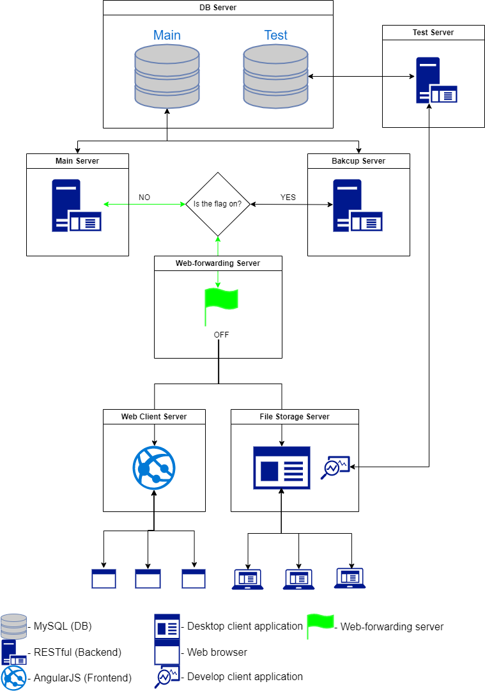
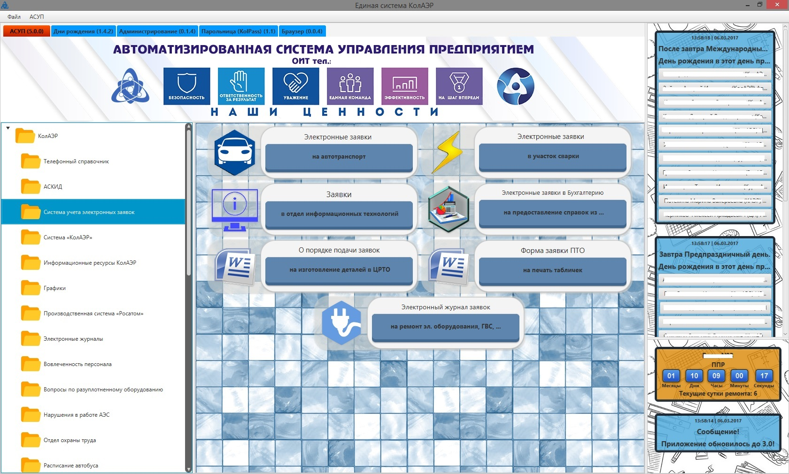
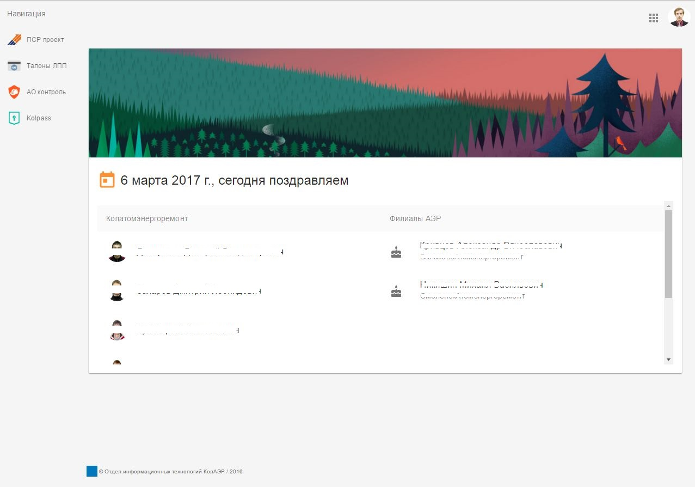
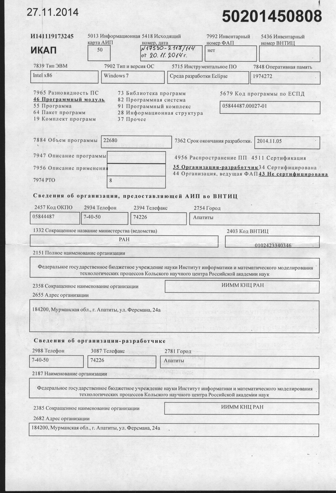
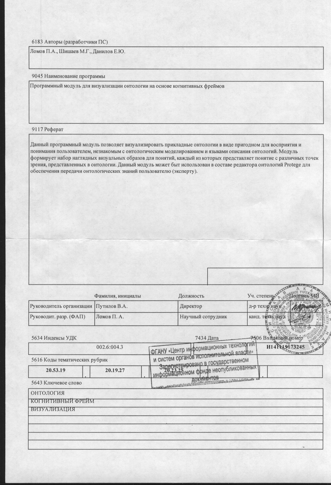
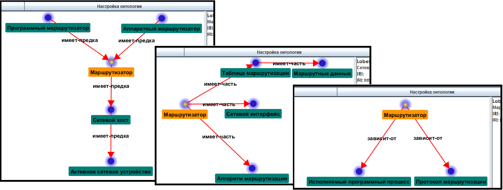

import Link from "@docusaurus/core/lib/client/exports/Link";
import SimpleTagList from "@site/src/components/SimpleTagList"
import Admonition from '@theme/Admonition';

# Портфолио

## Обо мне

Привет, я Женя. Java-разработчик и Ваш бро :D

## Опыт работы

В основном я работаю на Back-End, но есть опыт работы во Front-End и в программировании микроконтроллеров.

### IBS
<Admonition type="tip" icon="💡" title="Октябрь 2019 — февраль 2022 (2 года 5 месяцев)">

<table>
  <tr>
    <td>Сайт</td>
    <td><a href="https://ibs.ru/">https://ibs.ru/</a></td>
  </tr>
</table>


:::info Единый реестр населения

<table>
  <tr>
    <td>Должность</td>
    <td>Старший Java-разработчик</td>
  </tr>
  <tr>
    <td>Стек технологий</td>
    <td><SimpleTagList
      tags={["Java", "Spring Boot", "Spring Cloud", "Spring Security", "Spring Data", "Docker", "Kafka",
        "PostgreSQL", "Keycloak", "Hadoop", "HBase", "Elasticsearch", "JUnit", "Gradle", "Git"]}/>
    </td>
  </tr>
</table>

##### Обязанности
* Разработка подсистем: Архива данных, Управления и Мониторинг, Внешних взаимодействий и Нормативно-Справочной Информации

```mdx-code-block
<details>
  <summary>Подробнее</summary>
  <div>
```
##### Результат
* Разработана подсистема для работы с распределенным хранилищем Hadoop и записями в HBase
* Разработаны Spring Boot Starter для безопасности, мониторинга систем и поддержки RSQL для систем с динамическими сущностями БД
* Разработана подсистема Нормативно-Справочной Информации

```mdx-code-block
  </div>
</details>
```
:::
</Admonition>

<br/><br/>


### Digital Zone

<Admonition type="tip" icon="💡" title="Сентябрь 2016 — октябрь 2019 (3 года 4 месяца)">

<table>
  <tr>
    <td>Сайт</td>
    <td><a href="https://dz.ru/">https://dz.ru/</a></td>
  </tr>
</table>


:::info ОБОЗ

<table>
  <tr>
    <td>Должность</td>
    <td>Руководитель группы</td>
  </tr>
  <tr>
    <td>Стек технологий</td>
    <td><SimpleTagList
      tags={["Java", "Spring Boot", "Spring Cloud", "Spring Security", "Spring Data", "Docker", "Kafka", "PostgreSQL", "Keycloak", "JUnit", "Gradle", "Git"]}/>
    </td>
  </tr>
</table>

Система для для провайдера логических услуг

##### Обязанности
* Разработка архитектуры подсистем (Бонусы и Рейтинги)
* Оценка трудозатрат по ТЗ
* Коммуникация с заказчиком
* Координация деятельность команды разработчиков
* Разработка сервисов для информационной системы
* Ввод в эксплуатацию

```mdx-code-block
<details>
<summary>Подробнее</summary>
<div>
```
  ##### Результат
  * Разработана асинхронная архитектура взаимодействия подсистем
  * Разработаны сервисы для Рейтинга и Бонусных программ

```mdx-code-block
</div>
</details>
```
:::

:::info PECOM

<table>
  <tr>
    <td>Должность</td>
    <td>Java-разработчик</td>
  </tr>
  <tr>
    <td>Стек технологий</td>
    <td><SimpleTagList tags={["Java", "Java EE", "IBM WebSphere MQ", "Oracle", "Maven", "JBoss", "Git"]}/></td>
  </tr>
</table>

Система для ТК

##### Обязанности
* Оценка трудозатрат по ТЗ
* Коммуникация с заказчиком
* Разработка сервисов для информационной системы

```mdx-code-block
<details>
  <summary>Подробнее</summary>
  <div>
    ```
    ##### Результат
    * Разработаны микросервисы: Отзывы, Нотификация, Заказы, Оплата, Продвижение

    ```mdx-code-block
  </div>
</details>
```
:::

:::info DZ-Market

<table>
  <tr>
    <td>Должность</td>
    <td>Java-разработчик</td>
  </tr>
  <tr>
    <td>Стек технологий</td>
    <td><SimpleTagList
      tags={["Java", "Spring Boot", "Spring MVC", "Spring Security", "Spring JDBC", "Апрентис", "Freemarker", "PostgreSQL", "Maven", "Git"]}/>
    </td>
  </tr>
</table>

##### Обязанности
Разработка платформы электронной коммерции (Маркетплейс)

```mdx-code-block
<details>
  <summary>Подробнее</summary>
  <div>
    ```
    ##### Результат
    * Разработаны микросервисы: Отзывы, Нотификация, Заказы, Оплата, Продвижение

    ```mdx-code-block
  </div>
</details>
```
:::

<br/>

:::info Face-X

<table>
  <tr>
    <td>Должность</td>
    <td>Java-разработчик</td>
  </tr>
  <tr>
    <td>Стек технологий</td>
    <td><SimpleTagList tags={["Java", "Spring Boot", "Апрентис", "Freemarker", "H2", "JavaFX", "Gradle", "Git"]}/>
    </td>
  </tr>
</table>

##### Обязанности
* Оценка трудозатрат по ТЗ
* Коммуникация с заказчиком
* Разработка ПО
* Ввод в эксплуатацию

```mdx-code-block
<details>
  <summary>Подробнее</summary>
  <div>
    ```
    ##### Результат
    * Разработан desktop client на Java для трансляции потока с камеры и наложением
    графических 2D объектов
    * Разработан CRUD сервиса для синхронизации данных клиента и внешним сервисом. Реализован на внутреннем проекте
    "Апрентис"

    ```mdx-code-block
  </div>
</details>
```
:::

<br/>

:::info DoIT

<table>
  <tr>
    <td>Должность</td>
    <td>Java-разработчик</td>
  </tr>
  <tr>
    <td>Стек технологий</td>
    <td><SimpleTagList
      tags={["Vue", "Java", "Spring Boot", "String JDBC", "Freemarker", "String Test", "JUnit", "Mockito", "PostgreSQL", "Gradle", "Git"]}/>
    </td>
  </tr>
</table>

##### Обязанности
Разработка мобильного сервиса поиска надежных специалистов для выполнения бытовых и фриланс
заданий.

```mdx-code-block
<details>
  <summary>Подробнее</summary>
  <div>
    ```
    ##### Результат
    * Разработаны микросервисы для работы мобильного приложения
    * Разработан сервис для администрирования

    ```mdx-code-block
  </div>
</details>
```
:::

<br/>

:::info Личный кабинет Tele2

<table>
  <tr>
    <td>Должность</td>
    <td>Java-разработчик</td>
  </tr>
  <tr>
    <td>Стек технологий</td>
    <td><SimpleTagList
      tags={["Java", "Spring MVC", "Spring Security", "Hibernate", "Freemarker", "PostgreSQL", "Grafana", "Prometheus", "Gradle", "Git"]}/>
    </td>
  </tr>
</table>

##### Обязанности
Разработка вспомогательных сервисов системы.

```mdx-code-block
<details>
  <summary>Подробнее</summary>
  <div>
    ```
    ##### Результат
    * Рефакторинг и баг-фикс
    * SOAP сервис по отправки Push-уведомлений
    * Миграция мониторинга сервисов "Grafana" на "Prometheus"
    ```mdx-code-block
  </div>
</details>
```
:::
</Admonition>

<br/><br/>

### Колатомэнергоремонт

<Admonition type="tip" icon="💡" title="Ноябрь 2015 — май 2019 (3 года 8 месяцев)">

<table>
  <tr>
    <td>Сайт</td>
    <td><a href="http://aer-rea.ru/">http://aer-rea.ru/</a></td>
  </tr>
</table>

:::info Система управления предприятием

<table>
  <tr>
    <td>Должность</td>
    <td>Инженер</td>
  </tr>
  <tr>
    <td>Стек технологий</td>
    <td><SimpleTagList tags={["Angular", "Java", "Spring Boot", "Spring MVC", "Spring Security", "Spring Data",
      "Hibernate", "Freemarker", "JavaFX", "OSGi", "JUnit", "String Test", "MySQL", "Maven", "Gradle", "Git"]}/></td>
  </tr>
</table>

##### Обязанности
Разработка платформы управления предприятием.

```mdx-code-block
<details>
  <summary>Подробнее</summary>
  <div>
    ```
    ##### Результат
    Разработал отказоустойчивою (в простом виде) модульную архитектуру платформы для управления предприятием.
    * На Back-End работал restful сервис на Spring Boot. Работает через прокси Gateway. В прокси настроен флаг,
    который роутит запросы либо на основной сервис, либо на дополнительный
    * Front-End для WEB делал на Angular 6, который взаимодействовал с сервисов через REST API
    * Front-End для Desktop делал на JavaFX. Модуля для клиента подгружались через OSGi, а взаимодействие с сервером
    было через REST API
    * Модули/приложения для платформы.

    ##### Архитектура
    
    ##### Скриншоты
    
    
    ```mdx-code-block
  </div>
</details>
```
:::
</Admonition>

<br/><br/>

### Институт информатики и математического моделирования

<Admonition type="tip" icon="💡" title="Февраль 2014 — октябрь 2015 (1 год 9 месяцев)">

<table>
  <tr>
    <td>Сайт</td>
    <td><a href="http://www.iimm.ru/">http://www.iimm.ru/</a></td>
  </tr>
</table>

:::info Визуализация OWL-онтологии на основе когнитивных фреймов

<table>
  <tr>
    <td>Должность</td>
    <td>Техник</td>
  </tr>
  <tr>
    <td>Git</td>
    <td><a href="https://github.com/danilov0x33/Cognitive-Frame-Visualization">Cognitive-Frame-Visualization</a></td>
  </tr>
  <tr>
    <td>Стек технологий</td>
    <td><SimpleTagList tags={["Java", "Swing", "OSGi", "OWL", "Ant", "Maven", "Git"]}/></td>
  </tr>
</table>

##### Обязанности
Разработка программного средства визуализации OWL-онтологии на основе когнитивных фреймов на языке Java.

```mdx-code-block
<details>
  <summary>Подробнее</summary>
  <div>
    ```
    ##### Результат
    Разработал desktop Java приложение с GUI на Swing, которое считывает онтологию из файла в формате OWL и строит
    граф.
    Так же есть возможность подключить в качестве плагина к [Protege](https://protege.stanford.edu/) через OSGi.

    ##### Регистрация ПО
    Данное ПО было зарегистрировано в Федеральном государственном автономном научном учреждении
    «Центр информационных технологий и систем органов исполнительной власти». Номер: 50201450808 от 27.11.2014.

    
    

    ##### Скриншоты
    
    ```mdx-code-block
  </div>
</details>
```
:::
</Admonition>


## Список публикаций

* Ломов П.А. Визуализация с помощью когнитивных фреймов для передачи знаний / Ломов П.А., Данилов Е.Ю. // Информационные системы и технологии. - № 3 (89) май-июнь 2015. - С.10-18. ISSN 2072-8964.
* Ломов, П. А. Визуализация онтологий с использованием когнитивных фреймов для передачи знаний / Ломов, П. А., Данилов, Е. Ю.,// Веб-программирование и интернет-технологии WebConf 2015 : материалы 3-й Междунар. науч.-практ. конф., Минск, 12-14 мая 2015 г. - Минск, 2015. - С. 35.
* Ломов П.А. Построение когнитивных фреймов на основе онтологических паттернов для визуализации онтологий /Ломов П.А., Данилов Е.Ю. //Труды Кольского научного центра. Информационные технологии. 3/2015(29). -Вып. 6. -Апатиты: Изд-во КНЦ РАН. -с. 43-53. ISSN 2307-5252; ISBN 978-5-91137-317-7
* Данилов Е.Ю., Ломов П.А.Разработка программного средства визуализации онтологий на основе паттернов: тезисы докладов ХVIII Межрегиональной научно-практ. конф. студентов, аспирантов и молодых ученых, г. Апатиты, 15-17 апреля 2015г. -Апатиты: Изд-во КФ ПетрГУ, 2015. -Ч.1. -С.24-25.


## Контакты {#contacts}

* <a href="mailto: danilov0x33@gmail.com">danilov0x33@gmail.com</a>
* <a href="https://t.me/danilov0x33">Telegram</a>
* <a href="https://join.skype.com/invite/n6jHhcjaI3HC">Skype</a>
* <a href="https://www.linkedin.com/in/danilov0x33">LinkedIn</a>
* <a href="https://github.com/danilov0x33">GitHub</a>
* <a href="https://habr.com/ru/users/zhekichan51">Habr</a>
